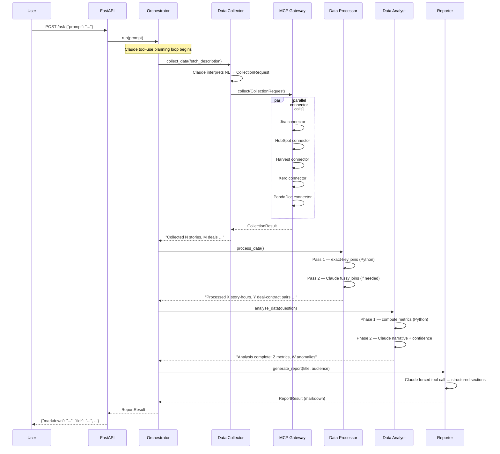

# Internal Agents

Multi-agent system integrating Jira, HubSpot, Xero, Harvest, and PandaDoc via an MCP Gateway.

## Architecture

```
User → Orchestrator Agent
         ├── Data Collector Agent → MCP Gateway
         │                              ├── Jira
         │                              ├── HubSpot
         │                              ├── Xero
         │                              ├── Harvest
         │                              └── PandaDoc
         └── Skill Pipeline
               ├── Data Processor
               ├── Data Analyst
               └── Reporter
```

## Sequence Diagram



## Agent responsibilities

| Agent | Input | Output | LLM calls |
|---|---|---|---|
| **Orchestrator** | User prompt | ReportResult or clarification | 1 planning loop |
| **Data Collector** | NL string or CollectionRequest | CollectionResult | 0–1 (NL interpretation) |
| **Data Processor** | CollectionResult | ProcessedDataset | 0–1 (fuzzy join, only if needed) |
| **Data Analyst** | ProcessedDataset + question | AnalysisResult | 1 (narrative) |
| **Reporter** | AnalysisResult + ReportRequest | ReportResult | 1 (structured report) |

## Quick Start

### Step 1 — Install

```bash
# Install uv (fast Python package manager) if you don't have it
pip install uv

# Create a virtual environment and install all dependencies
uv venv
uv pip install -e ".[dev]"
```

Or use the Makefile shortcut:

```bash
make install
```

### Step 2 — Configure

```bash
# Create your .env from the template
cp .env.example .env   # or: make env
```

Open `.env` and set at minimum:

```dotenv
ANTHROPIC_API_KEY=sk-ant-...   # required — get from console.anthropic.com

# Leave everything else blank and keep MOCK_MODE=true for a demo run.
# The system will return realistic fixture data without calling any SaaS API.
MOCK_MODE=true
```

When you're ready to wire up real credentials, fill in the remaining keys and
set `MOCK_MODE=false`.

### Step 3 — Start the API

```bash
make dev
# or:
MOCK_MODE=true uv run uvicorn src.api.main:app --reload --log-level info
```

You should see:

```
INFO     Starting Internal Agents API | mock_mode=True | model=claude-opus-4-7
INFO     Application startup complete.
```

### Step 4 — Run the demo

**Health check:**

```bash
curl http://localhost:8000/health
# {"status":"ok","mock_mode":true,"model":"claude-opus-4-7","timestamp":"..."}
```

**Prompt 1 — Sprint delivery vs hours:**

```bash
curl -s -X POST http://localhost:8000/ask \
  -H "Content-Type: application/json" \
  -d '{"prompt": "Summarize last sprint delivery vs hours logged"}' \
  | python -m json.tool
```

**Prompt 2 — Deals without contracts:**

```bash
curl -s -X POST http://localhost:8000/ask \
  -H "Content-Type: application/json" \
  -d '{"prompt": "Which deals closed last month dont have a signed contract yet?"}' \
  | python -m json.tool
```

**Prompt 3 — Contractor costs:**

```bash
curl -s -X POST http://localhost:8000/ask \
  -H "Content-Type: application/json" \
  -d '{"prompt": "Show contractor cost per project for Q1"}' \
  | python -m json.tool
```

Or run all three at once:

```bash
make demo
```

**WebSocket streaming demo** (streams progress events live, then the report):

```bash
# In a second terminal, while the API is running:
uv run python scripts/ws_demo.py "Summarize last sprint delivery vs hours logged"
# or:
make stream-demo
```

### Step 5 — Run tests

```bash
make test              # full suite (no credentials needed — MOCK_MODE=true)
make test-gateway      # connector mock tests only
make test-agents       # per-agent unit tests only
make test-e2e          # end-to-end pipeline tests only
```

### Switching to real credentials

1. Edit `.env` — fill in all API keys and set `MOCK_MODE=false`
2. Restart with `make start` (no `--reload`, production-style)
3. The connectors switch from fixture data to live HTTP calls automatically
4. Each connector has a `TODO` comment pointing to the official API docs for
   anything that needs workspace-specific configuration (board IDs, field names, etc.)

## Development

```bash
make dev              # mock mode, live reload, INFO logging
make dev-debug        # mock mode, live reload, DEBUG logging (shows all prompts)
make test             # full test suite
```

All `make` targets:

```bash
make help
```

## Project structure

```
internal-agents/
├── src/
│   ├── agents/
│   │   ├── base.py            # BaseAgent + ToolSpec + tool-use loop
│   │   ├── orchestrator.py    # Plans and drives the pipeline
│   │   ├── data_collector.py  # NL → CollectionRequest → MCPGateway
│   │   ├── data_processor.py  # Exact + fuzzy joins → ProcessedDataset
│   │   ├── data_analyst.py    # Metrics + anomalies + Claude narrative
│   │   └── reporter.py        # Audience-aware markdown report
│   ├── gateway/
│   │   ├── mcp_gateway.py     # Fans out to connectors in parallel
│   │   └── connectors/        # One file per SaaS (Jira/HubSpot/Xero/Harvest/PandaDoc)
│   ├── models/
│   │   └── schemas.py         # All Pydantic models
│   ├── api/
│   │   └── main.py            # FastAPI entry point
│   └── config.py              # Settings from env vars
└── tests/
    ├── test_gateway.py        # Connector mock-mode tests
    ├── test_agents.py         # Per-agent unit tests
    └── test_e2e.py            # End-to-end prompt tests
```
